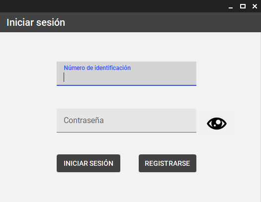
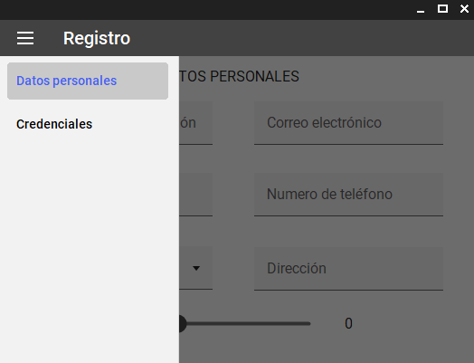
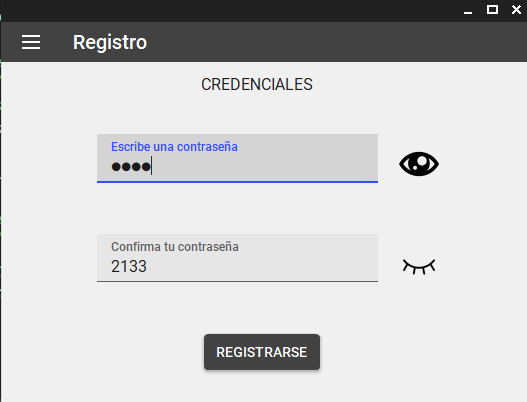
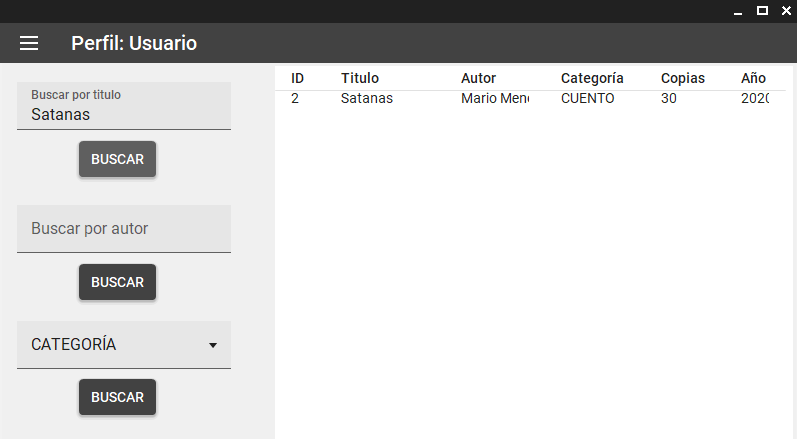

# LMS (Library Management System)

Welcome to the Library Management System, a project designed to streamline library operations by efficiently managing books, loans, returns, and user interactions.

---

## Images

### Screenshot 1

- *Login form*

### Screenshot 2

- *Registration Form*

### Screenshot 3

- *credentials section in the registration form*

### Screenshot 4

- *sample search book by search criteria section from normal user interface*

### Screenshot 5

- *One of the views of a librarian profile, where you can see some of the sections enabled within this profile. A sample of what a librarian could do*

---
## Table of Contents

- [LMT (Library Management System)](#lmt-library-management-system)
  - [Images](#Images)
  - [Description](#description)
  - [Functional Requirements](#functional-requirements)
  - [Non-Functional Requirements](#non-functional-requirements)
  - [Architecture](#architecture)
  - [Database](#database)
  - [Members](#members)
  - [License](#license)

---
## Description

**Objective:**
Develop a library management system to provide efficient tools for librarians and users to manage books, loans, and returns.

**Detailed Description:**
Library Management System is a Windows Forms application aiming to optimize library management. It provides librarians and users with an intuitive and efficient tool for book management.

---
## Functional Requirements

1. **Book Registration:**
   - Librarians can register books in the database.
   - Detailed information about each book (title, author, category, number of copies, etc.) is entered.

2. **Loan Management:**
   - Librarians can register loans of books to users.
   - Availability of books is checked before registering a loan.

3. **Return Registration:**
   - Librarians can register the return of books by users.

4. **Book Search and Query:**
   - Users can search for books by title, author, category, or keyword.
   - The system displays relevant search results and allows users to view details of available books.

5. **Authentication and Security:**
   - Librarians and users must authenticate to access the system.

---
## Non-Functional Requirements

1. **User-Friendly Interface:**
   - The interface is intuitive and user-friendly for both librarians and users.

2. **Scalability:**
   - The system is scalable to handle a growth in the number of books and users without performance loss.

3. **Efficient Performance:**
   - The system is fast and efficient in searching and retrieving information from the database.

4. **Availability:**
   - The system is available for use during library operating hours without prolonged interruptions.

5. **Maintenance and Updates:**
   - Maintenance and updates are easy to perform without significant service interruptions.

---
## Architecture

The project follows a layered architecture for better organization and separation of concerns:

- **data:** Configuration for mapping with Entity Framework.
- **interfaces:**
  - **repository:** interface to implement per repository layer
  - **service:** interface to implement per service layer
- **model:** Contains entities.
- **repository:** Interacts with the database.
- **resources:** Images used in the project.
- **service:** Business logic.
- **ui:** Forms of the user interface.

This architecture promotes modularity and maintainability by separating database interactions, business logic, and the user interface into distinct layers.

---
## Database

SQL Server is used as the database management system.

---
## Members

- [Daniel Estiven Villegas Bedoya](https://www.linkedin.com/in/daesvi/)

---
## License

This project is licensed under the [MIT License](LICENSE).
